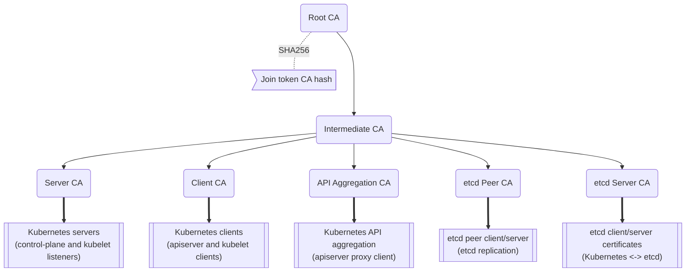
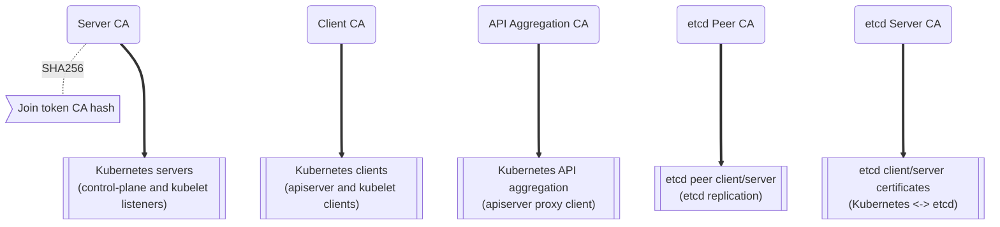
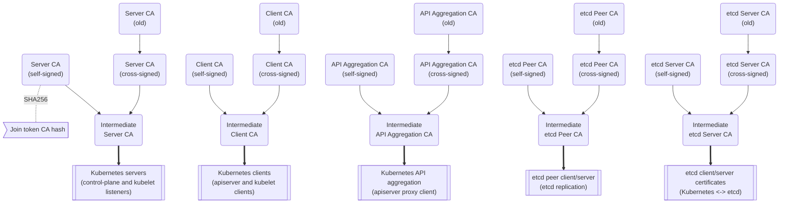

## Client and Server Certificates

RKE2 client and server certificates are valid for 365 days from their date of issuance. Any certificates that are expired, or within 90 days of expiring, are automatically renewed every time RKE2 starts.

### Rotating Client and Server Certificates Manually
When rotating client and server certificates manually, rotate certs on each node in the following order:
1. etcd servers
2. control-plane servers
3. agents

For each node, stop the server, use the `rke2 certificate rotate` subcommand to rotate the certs, then start the server once more; as in the following example:  

```bash
# Stop RKE2
systemctl stop rke2-server

# Rotate certificates
rke2 certificate rotate

# Start RKE2
systemctl start rke2-server
```

Individual or lists of certificates can be rotated by specifying the certificate name:

```bash
rke2 certificate rotate --service <SERVICE>,<SERVICE>
```

The following certificates can be rotated:  
`admin`, `api-server`, `controller-manager`, `scheduler`, `rke2-controller`, `rke2-server`, `cloud-controller`, `etcd`, `auth-proxy`, `kubelet`, `kube-proxy`.

## Certificate Authority (CA) Certificates

Kubernetes requires a number of CA certificates for proper operation. For more information on how Kubernetes uses CA certificates, see the Kubernetes [PKI Certificates and Requirements](https://kubernetes.io/docs/setup/best-practices/certificates/#all-certificates) documentation.

By default, RKE2 generates self-signed CA certificates during startup of the first server node. These CA certificates are valid for 10 years from date of issuance, and are not automatically renewed.

The authoritative CA certificates and keys are stored within the datastore's bootstrap key, encrypted using the server token as the PBKDF2 passphrase with AES256-GCM and HMAC-SHA1.
Copies of the CA certificates and keys are extracted to disk during RKE2 server startup.
Any server may generate leaf certificates for nodes as they join the cluster, and the Kubernetes [Certificates API](https://kubernetes.io/docs/reference/access-authn-authz/certificate-signing-requests/) controllers may issue additional certificates at runtime.

### Rotating CA Certificates

:::info Version Gate
Available as of the 2023-02 releases (v1.26.2+rke2r1, v1.25.7+rke2r1, v1.24.11+rke2r1, v1.23.17+rke2r1).
:::

To rotate CA certificates and keys, use the `rke2 certificate rotate-ca` command.
This command performs integrity checks to confirm that the updated certificates and keys are usable.
If the updated data is acceptable, the datastore's encrypted bootstrap key is updated, and the new certificates and keys will be used the next time RKE2 starts.
If problems are encountered while validating the certificates and keys, an error is reported to the system log and the operation is cancelled without changes.


### Using Custom CA Certificates

If CA certificates and keys are found the correct location during initial startup of the first server in the cluster, automatic generation of CA certificates will be bypassed.

An example script to pre-create the appropriate certificates and keys is available [in the K3s repo at `contrib/util/generate-custom-ca-certs.sh`](https://github.com/k3s-io/k3s/blob/master/contrib/util/generate-custom-ca-certs.sh).
This script should be run prior to starting RKE2 for the first time, and will create a full set of leaf CA certificates signed by common Root and Intermediate CA certificates.
If you have an existing Root or Intermediate CA, this script can be used (or used as a starting point) to create the correct CA certificates to provision a RKE2 cluster with PKI rooted in an existing authority.

Custom Certificate Authority files must be placed in `/var/lib/rancher/rke2/server/tls`. The following files are required:
* `server-ca.crt`
* `server-ca.key`
* `client-ca.crt`
* `client-ca.key`
* `request-header-ca.crt`
* `request-header-ca.key`  
* `etcd/peer-ca.crt`  
* `etcd/peer-ca.key`
* `etcd/server-ca.crt`
* `etcd/server-ca.key`  
  *// note: This is the private key used to sign service-account tokens. It does not have a corresponding certificate.*
* `service.key`

#### Custom CA Topology

Custom CA Certificates should observe the following topology:



#### Using the Example Script

:::info Important
If you want to sign the cluster CA certificates with an existing root CA using the example script, you must place the root and intermediate files in the target directory prior to running the script.
If the files do not exist, the script will create new root and intermediate CA certificates.
:::

If you want to use only an existing root CA certificate, provide the following files:
* `root-ca.pem`
* `root-ca.key`

If you want to use existing root and intermediate CA certificates, provide the following files:
* `root-ca.pem`
* `intermediate-ca.pem`
* `intermediate-ca.key`

To use the example script to generate custom certs and keys before starting RKE2, run the following commands:
```bash
# Create the target directory for cert generation.
mkdir -p /var/lib/rancher/rke2/server/tls

# Copy your root CA cert and intermediate CA cert+key into the correct location for the script.
# For the purposes of this example, we assume you have existing root and intermediate CA files in /etc/ssl.
# If you do not have an existing root and/or intermediate CA, the script will generate them for you.
cp /etc/ssl/certs/root-ca.pem /etc/ssl/certs/intermediate-ca.pem /etc/ssl/private/intermediate-ca.key /var/lib/rancher/rke2/server/tls

# Generate custom CA certs and keys.
curl -sL https://github.com/k3s-io/k3s/raw/master/contrib/util/generate-custom-ca-certs.sh | PRODUCT=rke2 bash - 
```

If the command completes successfully, you may install and/or start RKE2 for the first time.
If the script generated root and/or intermediate CA files, you should back up these files so that they can be reused if it is necessary to rotate the CA certificates at a later date.

### Rotating Custom CA Certificates

To rotate custom CA certificates, use the `rke2 certificate rotate-ca` subcommand.
Updated files must be staged into a temporary directory, loaded into the datastore, and rke2 must be restarted on all nodes to use the updated certificates.

:::warning
You must not overwrite the currently in-use data in `/var/lib/rancher/rke2/server/tls`.  
Stage the updated certificates and keys into a separate directory.
:::

A cluster that has been started with custom CA certificates can renew or rotate the CA certificates and keys non-disruptively, as long as the same root CA is used.

If a new root CA is required, the rotation will be disruptive. The `rke2 certificate rotate-ca --force` option must be used, all nodes (servers and agents) will need to be reconfigured to use the new token value, and pods will need to be restarted to trust the new root CA.

#### Using the Example Script

The example `generate-custom-ca-certs.sh` script linked above can also be used to generate updated certs in a new temporary directory, by copying files into the correct location and setting the `DATA_DIR` environment variable.
To use the example script to generate updated certs and keys, run the following commands:
```bash
# Create a temporary directory for cert generation.
mkdir -p /opt/rke2/server/tls

# Copy your root CA cert and intermediate CA cert+key into the correct location for the script.
# Non-disruptive rotation requires the same root CA that was used to generate the original certificates.
# If the original files are still in the data directory, you can just run:
cp /var/lib/rancher/rke2/server/tls/root-ca.* /var/lib/rancher/rke2/server/tls/intermediate-ca.* /opt/rke2/server/tls

# Copy the current service-account signing key, so that existing service-account tokens are not invalidated.
cp /var/lib/rancher/rke2/server/tls/service.key /opt/rke2/server/tls

# Generate updated custom CA certs and keys.
curl -sL https://github.com/k3s-io/k3s/raw/master/contrib/util/generate-custom-ca-certs.sh | DATA_DIR=/opt/rke2 PRODUCT=rke2 bash -

# Load the updated CA certs and keys into the datastore.
rke2 certificate rotate-ca --path=/opt/rke2/server
```

If the `rotate-ca` command returns an error, check the service log for errors.
If the command completes successfully, restart RKE2 on all nodes in the cluster - servers first, then agents.

If you used the `--force` option or changed the root CA, ensure that any nodes that were joined with a secure token are reconfigured to use the new token value, prior to being restarted.
The token may be stored in a `.env` file, systemd unit, or config.yaml, depending on how the node was configured during initial installation.

### Rotating Self-Signed CA Certificates

To rotate the RKE2-generated self-signed CA certificates, use the `rke2 certificate rotate-ca` subcommand.
Updated files must be staged into a temporary directory, loaded into the datastore, and rke2 must be restarted on all nodes to use the updated certificates.

:::warning
You must not overwrite the currently in-use data in `/var/lib/rancher/rke2/server/tls`.  
Stage the updated certificates and keys into a separate directory.
:::

If the cluster has been started with default self-signed CA certificates, rotation will be disruptive. All nodes that were joined with a secure token will need to be reconfigured to trust the new CA hash.
If the new CA certificates are not cross-signed by the old CA certificates, you will need to use the `--force` option to bypass integrity checks, and pods will need to be restarted to trust the new root CA.

#### Default CA Topology
The default self-signed CA certificates have the following topology:



When rotating the default self-signed CAs, a modified certificate topology with intermediate CAs and a new root CA cross-signed by the old CA can be used so that there is a continuous chain of trust between the old and new CAs:


#### Using The Example Script

An example script to create updated CA certificates and keys cross-signed by the existing CAs is available [in the K3s repo at `contrib/util/rotate-default-ca-certs.sh`](https://github.com/k3s-io/k3s/blob/master/contrib/util/rotate-default-ca-certs.sh).

To use the example script to generate updated self-signed certificates that are cross-signed by the existing CAs, run the following commands:
```bash
# Create updated CA certs and keys, cross-signed by the current CAs.
# This script will create a new temporary directory containing the updated certs, and output the new token values.
curl -sL https://github.com/k3s-io/k3s/raw/master/contrib/util/rotate-default-ca-certs.sh | PRODUCT=rke2 bash -

# Load the updated certs into the datastore; see the script output for the updated token values.
rke2 certificate rotate-ca --path=/var/lib/rancher/rke2/server/rotate-ca
```

If the `rotate-ca` command returns an error, check the service log for errors.
If the command completes successfully, restart RKE2 on all nodes in the cluster - servers first, then agents.

Ensure that any nodes that were joined with a secure token, including other server nodes, are reconfigured to use the new token value prior to being restarted.
The token may be stored in a `.env` file, systemd unit, or config.yaml, depending on how the node was configured during initial installation.

## Service-Account Issuer Key Rotation

The service-account issuer key is an RSA private key used to sign service-account tokens.
When rotating the service-account issuer key, at least one old key should be retained in the file so that existing service-account tokens are not invalidated.
It can be rotated independent of the cluster CAs by using the `rke2 certificate rotate-ca` to install only an updated `service.key` file that includes both the new and old keys.

:::warning
You must not overwrite the currently in-use data in `/var/lib/rancher/rke2/server/tls`.  
Stage the updated key into a separate directory.
:::

For example, to rotate only the service-account issuer key, run the following commands:
```bash
# Create a temporary directory for cert generation
mkdir -p /opt/rke2/server/tls

# Check OpenSSL version
openssl version | grep -qF 'OpenSSL 3' && OPENSSL_GENRSA_FLAGS=-traditional

# Generate a new key
openssl genrsa ${OPENSSL_GENRSA_FLAGS:-} -out /opt/rke2/server/tls/service.key 2048

# Append the existing key to avoid invalidating current tokens
cat /var/lib/rancher/rke2/server/tls/service.key >> /opt/rke2/server/tls/service.key

# Load the updated key into the datastore
rke2 certificate rotate-ca --path=/opt/rke2/server
```

It is normal to see warnings for files that are not being updated. If the `rotate-ca` command returns an error, check the service log for errors.
If the command completes successfully, restart RKE2 on all servers in the cluster. It is not necessary to restart agents or restart any pods.

